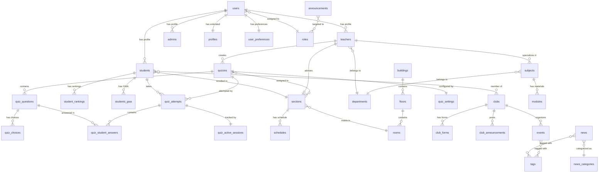

# Appendix E: Database Schema

Complete Supabase database schema documentation for the Southville 8B NHS Edge application.

---

## Table of Contents

1. [Overview](#overview)
2. [Database Architecture](#database-architecture)
3. [Schema Organization](#schema-organization)
4. [Core Tables](#core-tables)
5. [Student Management Tables](#student-management-tables)
6. [Teacher Management Tables](#teacher-management-tables)
7. [Academic Management Tables](#academic-management-tables)
8. [Quiz System Tables](#quiz-system-tables)
9. [Content Management Tables](#content-management-tables)
10. [Club Management Tables](#club-management-tables)
11. [Resource Management Tables](#resource-management-tables)
12. [Infrastructure Tables](#infrastructure-tables)
13. [Relationships and Foreign Keys](#relationships-and-foreign-keys)
14. [Row-Level Security Policies](#row-level-security-policies)
15. [Database Indexes](#database-indexes)
16. [Views and Materialized Views](#views-and-materialized-views)
17. [Database Functions and Triggers](#database-functions-and-triggers)
18. [Entity Relationship Diagram](#entity-relationship-diagram)
19. [Migration Patterns](#migration-patterns)
20. [Best Practices](#best-practices)

---

## Overview

The Southville 8B NHS Edge application uses **Supabase PostgreSQL** as its primary database. The schema is designed to support a comprehensive school management system with role-based access control, audit logging, and real-time capabilities.

### Key Characteristics

- **Database Provider**: Supabase (PostgreSQL 15+)
- **Total Tables**: 100+ tables
- **Authentication**: Supabase Auth with JWT tokens
- **Security**: Row-Level Security (RLS) policies on all tables
- **Naming Convention**: snake_case for columns and tables
- **Primary Keys**: UUID v4 with `gen_random_uuid()`
- **Timestamps**: Automatic `created_at` and `updated_at` tracking
- **Soft Deletes**: `deleted_at` and `is_deleted` columns for recoverable deletions

---

## Database Architecture

### Architecture Principles

1. **Domain-Driven Design**: Tables are organized by functional domains
2. **Normalized Structure**: Third normal form (3NF) with denormalization where needed
3. **Audit Trail**: Comprehensive tracking of changes with audit log tables
4. **Scalability**: Indexed for performance with materialized views for analytics
5. **Security-First**: RLS policies enforce data access at the database level

### Technology Stack

- **PostgreSQL 15+**: Core database engine
- **Supabase**: Database hosting and real-time subscriptions
- **PostgREST**: Automatic REST API generation
- **pg_cron**: Scheduled database tasks
- **pgjwt**: JWT token verification

---

## Schema Organization

The database schema is organized into 18 functional sections:

1. **Core / User Management** - Users, roles, permissions, profiles
2. **Student Management** - Student profiles, activities, rankings
3. **Teacher Management** - Teacher profiles and assignments
4. **Admin Management** - Administrator profiles
5. **Academic Management** - Academic years, periods, calendar
6. **Subject & Department** - Subjects, departments, specializations
7. **Schedule & Section** - Class sections, schedules, timetables
8. **Building & Room** - Campus infrastructure, facilities
9. **Club Management** - Student clubs, memberships, forms
10. **Event Management** - School events, schedules, FAQs
11. **Announcement Management** - Announcements, targeting
12. **News Management** - News articles, journalism platform
13. **Gallery Management** - Photo galleries, albums, media
14. **Quiz System** - Quizzes, questions, attempts, grading
15. **Learning Resources** - Modules, teacher files, materials
16. **Chat & Messaging** - Conversations, messages, participants
17. **Alerts & Notifications** - User alerts, banners
18. **Tags & Miscellaneous** - Shared resources, FAQs

---

## Core Tables

### users

The central table for all system users.

```sql
CREATE TABLE users (
  id uuid PRIMARY KEY DEFAULT gen_random_uuid(),
  full_name varchar NOT NULL,
  email varchar UNIQUE NOT NULL,
  password_hash varchar NOT NULL,
  role_id uuid REFERENCES roles(id),
  status varchar DEFAULT 'Active',
  last_login_at timestamp,
  created_at timestamp DEFAULT now(),
  updated_at timestamp DEFAULT now()
);
```

**Columns:**
- `id` - Unique user identifier (UUID)
- `full_name` - User's full display name
- `email` - Unique email address for authentication
- `password_hash` - Bcrypt hashed password (managed by Supabase Auth)
- `role_id` - Foreign key to roles table
- `status` - Account status: 'Active', 'Inactive', 'Suspended'
- `last_login_at` - Timestamp of last successful login
- `created_at` - Account creation timestamp
- `updated_at` - Last profile update timestamp

**Indexes:**
- Primary key on `id`
- Unique index on `email`
- Index on `role_id` for role-based queries
- Index on `status` for filtering active users

### roles

Defines system-wide roles for authorization.

```sql
CREATE TABLE roles (
  id uuid PRIMARY KEY DEFAULT gen_random_uuid(),
  name varchar UNIQUE NOT NULL,
  created_at timestamp DEFAULT now(),
  updated_at timestamp DEFAULT now()
);
```

**Standard Roles:**
- `SuperAdmin` - Full system access
- `Admin` - Administrative access
- `Teacher` - Teacher-specific features
- `Student` - Student-specific features
- `Parent` - Parent portal access (future)

**RLS Policy:**
- Read: All authenticated users
- Write: SuperAdmin only

### profiles

Extended user profile information.

```sql
CREATE TABLE profiles (
  id uuid PRIMARY KEY DEFAULT gen_random_uuid(),
  user_id uuid UNIQUE REFERENCES users(id),
  avatar varchar,
  address varchar,
  bio text,
  phone_number varchar,
  social_media_links json
);
```

**Columns:**
- `user_id` - One-to-one relationship with users
- `avatar` - URL to profile picture (stored in R2/Cloudflare)
- `address` - Physical address
- `bio` - User biography/description
- `phone_number` - Contact phone number
- `social_media_links` - JSON object with social media profiles

### permissions

Permission keys for fine-grained access control (PBAC).

```sql
CREATE TABLE permissions (
  id uuid PRIMARY KEY DEFAULT gen_random_uuid(),
  key text UNIQUE NOT NULL,
  description text,
  created_at timestamp DEFAULT now()
);
```

**Permission Key Format:** `{domain}:{action}`

**Examples:**
- `quiz:create`
- `quiz:update_own`
- `quiz:delete_any`
- `announcement:publish`
- `student:view_grades`

### domain_roles

Domain-specific roles for Permission-Based Access Control (PBAC).

```sql
CREATE TABLE domain_roles (
  id uuid PRIMARY KEY DEFAULT gen_random_uuid(),
  domain_id uuid REFERENCES domains(id),
  name text NOT NULL,
  created_at timestamp DEFAULT now()
);
```

**Example Domain Roles:**
- Club Admin (for specific club)
- Subject Coordinator (for specific subject)
- Section Adviser (for specific section)

### domains

Resource domains for PBAC system.

```sql
CREATE TABLE domains (
  id uuid PRIMARY KEY DEFAULT gen_random_uuid(),
  type text NOT NULL,
  name text NOT NULL,
  created_by uuid REFERENCES users(id),
  created_at timestamp DEFAULT now()
);
```

**Domain Types:**
- `club` - Student clubs
- `subject` - Academic subjects
- `section` - Class sections
- `facility` - Campus facilities

### domain_role_permissions

Maps permissions to domain roles.

```sql
CREATE TABLE domain_role_permissions (
  id decimal PRIMARY KEY,
  domain_role_id uuid REFERENCES domain_roles(id),
  permission_id uuid REFERENCES permissions(id),
  allowed boolean NOT NULL,
  created_at timestamp DEFAULT now()
);
```

### user_domain_roles

Assigns domain roles to users.

```sql
CREATE TABLE user_domain_roles (
  id uuid PRIMARY KEY DEFAULT gen_random_uuid(),
  user_id uuid REFERENCES users(id),
  domain_role_id uuid REFERENCES domain_roles(id),
  created_at timestamp DEFAULT now()
);
```

### user_preferences

User-specific application preferences.

```sql
CREATE TABLE user_preferences (
  id uuid PRIMARY KEY DEFAULT gen_random_uuid(),
  user_id uuid UNIQUE REFERENCES users(id),
  web_theme varchar DEFAULT 'light',
  desktop_theme varchar DEFAULT 'light',
  language varchar DEFAULT 'en',
  created_at timestamp DEFAULT now(),
  updated_at timestamp DEFAULT now(),
  deleted_at timestamp
);
```

**Theme Options:** `light`, `dark`, `system`

**Language Options:** `en` (English), `tl` (Tagalog)

---

## Student Management Tables

### students

Core student profile information.

```sql
CREATE TABLE students (
  id uuid PRIMARY KEY DEFAULT gen_random_uuid(),
  user_id uuid UNIQUE REFERENCES users(id),
  first_name text NOT NULL,
  last_name text NOT NULL,
  middle_name text,
  student_id text UNIQUE,
  lrn_id text UNIQUE,
  grade_level text NOT NULL,
  enrollment_year int,
  honor_status text,
  rank int,
  section_id uuid REFERENCES sections(id),
  age int,
  birthday date,
  deleted_at timestamp
);
```

**Columns:**
- `student_id` - School-assigned student ID
- `lrn_id` - Learner Reference Number (DepEd)
- `grade_level` - Current grade level (7-10 for JHS)
- `enrollment_year` - Year of enrollment
- `honor_status` - Academic honor status: 'High Honors', 'With Honors', 'None'
- `rank` - Class rank within grade level
- `section_id` - Current assigned section

**Constraints:**
- `student_id` and `lrn_id` must be unique
- `grade_level` must be in ['7', '8', '9', '10']

### student_activities

Timeline of student activities for dashboard.

```sql
CREATE TABLE student_activities (
  id uuid PRIMARY KEY DEFAULT gen_random_uuid(),
  student_user_id uuid REFERENCES users(id),
  activity_type varchar NOT NULL,
  title varchar NOT NULL,
  description text,
  metadata json DEFAULT '{}',
  related_entity_id uuid,
  related_entity_type varchar,
  icon varchar,
  color varchar,
  is_highlighted boolean DEFAULT false,
  is_visible boolean DEFAULT true,
  activity_timestamp timestamp DEFAULT now(),
  created_at timestamp DEFAULT now(),
  updated_at timestamp DEFAULT now()
);
```

**Activity Types:**
- `quiz_completed`
- `assignment_submitted`
- `grade_released`
- `club_joined`
- `event_attended`
- `achievement_earned`

**Metadata Examples:**
```json
{
  "score": 95,
  "total_points": 100,
  "quiz_title": "Math Quiz 1"
}
```

### student_rankings

Historical ranking data per grading period.

```sql
CREATE TABLE student_rankings (
  id uuid PRIMARY KEY DEFAULT gen_random_uuid(),
  student_id uuid REFERENCES students(id),
  grade_level varchar NOT NULL,
  rank int NOT NULL,
  honor_status varchar,
  quarter varchar NOT NULL,
  school_year varchar NOT NULL,
  created_at timestamp DEFAULT now(),
  updated_at timestamp DEFAULT now()
);
```

**Quarter Values:** `Q1`, `Q2`, `Q3`, `Q4`

**Composite Unique Constraint:** `(student_id, quarter, school_year)`

### students_gwa

General Weighted Average (GWA) records.

```sql
CREATE TABLE students_gwa (
  id uuid PRIMARY KEY DEFAULT gen_random_uuid(),
  student_id uuid REFERENCES students(id),
  academic_year_id uuid REFERENCES academic_years(id),
  academic_period_id uuid REFERENCES academic_periods(id),
  gwa decimal NOT NULL CHECK (gwa >= 50.00 AND gwa <= 100.00),
  grading_period varchar[] NOT NULL,
  school_year varchar NOT NULL,
  remarks varchar,
  honor_status varchar DEFAULT 'None',
  recorded_by uuid REFERENCES teachers(id),
  created_at timestamp DEFAULT now(),
  updated_at timestamp DEFAULT now()
);
```

**GWA Calculation:** Weighted average of all subjects for the period

**Honor Status:**
- `High Honors` - GWA >= 95.00
- `With Honors` - GWA >= 90.00 and < 95.00
- `None` - GWA < 90.00

### emergency_contacts

Emergency contact information for students.

```sql
CREATE TABLE emergency_contacts (
  id uuid PRIMARY KEY DEFAULT gen_random_uuid(),
  student_id uuid REFERENCES students(id),
  guardian_name varchar NOT NULL,
  relationship varchar NOT NULL,
  phone_number varchar NOT NULL,
  email varchar,
  address varchar,
  is_primary boolean DEFAULT false,
  created_at timestamp DEFAULT now(),
  updated_at timestamp DEFAULT now()
);
```

**Relationship Types:** Parent, Guardian, Sibling, Other

**Constraint:** At least one primary contact per student

---

## Teacher Management Tables

### teachers

Core teacher profile information.

```sql
CREATE TABLE teachers (
  id uuid PRIMARY KEY DEFAULT gen_random_uuid(),
  user_id uuid UNIQUE REFERENCES users(id),
  first_name varchar NOT NULL,
  last_name varchar NOT NULL,
  middle_name varchar,
  age int,
  subject_specialization_id uuid REFERENCES subjects(id),
  department_id uuid REFERENCES departments(id),
  advisory_section_id uuid REFERENCES sections(id),
  birthday date,
  created_at timestamp DEFAULT now(),
  updated_at timestamp DEFAULT now(),
  deleted_at timestamp
);
```

**Columns:**
- `subject_specialization_id` - Primary subject expertise
- `department_id` - Assigned department
- `advisory_section_id` - Section where teacher is class adviser

**Unique Constraint:** One teacher can only advise one section

---

## Academic Management Tables

### academic_years

Academic year configuration.

```sql
CREATE TABLE academic_years (
  id uuid PRIMARY KEY DEFAULT gen_random_uuid(),
  year_name varchar UNIQUE NOT NULL,
  start_date date NOT NULL,
  end_date date NOT NULL,
  structure varchar[] DEFAULT ARRAY['quarters'],
  is_active boolean DEFAULT false,
  is_archived boolean DEFAULT false,
  description text,
  created_by uuid REFERENCES users(id),
  updated_by uuid REFERENCES users(id),
  created_at timestamp DEFAULT now(),
  updated_at timestamp DEFAULT now()
);
```

**Structure Options:**
- `quarters` - Q1, Q2, Q3, Q4 (default for PH K-12)
- `semesters` - 1st Semester, 2nd Semester
- `trimesters` - Three terms per year
- `custom` - Custom period configuration

**Constraints:**
- Only one active academic year at a time
- `end_date` must be after `start_date`
- Year name format: "2024-2025"

### academic_periods

Grading periods within an academic year.

```sql
CREATE TABLE academic_periods (
  id uuid PRIMARY KEY DEFAULT gen_random_uuid(),
  academic_year_id uuid REFERENCES academic_years(id),
  period_name varchar NOT NULL,
  period_order int NOT NULL,
  start_date date NOT NULL,
  end_date date NOT NULL,
  is_grading_period boolean DEFAULT true,
  weight decimal DEFAULT 1.00 CHECK (weight >= 0),
  description text,
  created_by uuid REFERENCES users(id),
  updated_by uuid REFERENCES users(id),
  created_at timestamp DEFAULT now(),
  updated_at timestamp DEFAULT now()
);
```

**Example Periods (Quarters):**
- Q1: August 1 - October 31 (weight: 0.25)
- Q2: November 1 - January 31 (weight: 0.25)
- Q3: February 1 - March 31 (weight: 0.25)
- Q4: April 1 - May 31 (weight: 0.25)

**Composite Unique Constraint:** `(academic_year_id, period_order)`

### academic_calendar

Monthly calendar structure.

```sql
CREATE TABLE academic_calendar (
  id uuid PRIMARY KEY DEFAULT gen_random_uuid(),
  year varchar NOT NULL,
  month_name varchar NOT NULL,
  term varchar,
  start_date date NOT NULL,
  end_date date NOT NULL,
  total_days int,
  description text,
  created_at timestamp DEFAULT now(),
  updated_at timestamp DEFAULT now()
);
```

### academic_calendar_days

Individual days with markers and notes.

```sql
CREATE TABLE academic_calendar_days (
  id bigint PRIMARY KEY,
  academic_calendar_id uuid REFERENCES academic_calendar(id),
  date date UNIQUE NOT NULL,
  day_of_week varchar NOT NULL,
  week_number int,
  is_weekend boolean DEFAULT false,
  is_holiday boolean DEFAULT false,
  is_current_day boolean DEFAULT false,
  marker_icon varchar,
  marker_color varchar,
  note text,
  created_at timestamp DEFAULT now()
);
```

**Marker Examples:**
- Holiday: icon='🎉', color='red'
- Exam Day: icon='📝', color='orange'
- No Classes: icon='🏖️', color='blue'

---

## Quiz System Tables

The quiz system is the most comprehensive subsystem with 20+ tables for complete quiz management, monitoring, and analytics.

### quizzes

Main quiz configuration table.

```sql
CREATE TABLE quizzes (
  quiz_id uuid PRIMARY KEY DEFAULT gen_random_uuid(),
  title varchar NOT NULL,
  description text,
  subject_id uuid REFERENCES subjects(id),
  teacher_id uuid REFERENCES teachers(id),
  type varchar DEFAULT 'form',
  grading_type varchar DEFAULT 'auto',
  time_limit int,
  start_date timestamp,
  end_date timestamp,
  status varchar DEFAULT 'draft',
  version int DEFAULT 1,
  parent_quiz_id uuid REFERENCES quizzes(quiz_id),
  visibility varchar DEFAULT 'section_only',
  allow_retakes boolean DEFAULT false,
  allow_backtracking boolean DEFAULT true,
  shuffle_questions boolean DEFAULT false,
  shuffle_choices boolean DEFAULT false,
  total_points decimal,
  passing_score decimal,
  created_at timestamp DEFAULT now(),
  updated_at timestamp DEFAULT now(),
  deleted_at timestamp,
  deleted_by uuid REFERENCES users(id)
);
```

**Quiz Types:**
- `form` - Standard form-based quiz
- `exam` - High-stakes examination
- `practice` - Practice quiz (no grading)
- `survey` - Survey/feedback form

**Grading Types:**
- `auto` - Automatic grading for objective questions
- `manual` - Requires teacher review
- `hybrid` - Mixed auto and manual grading

**Status Values:**
- `draft` - Being created, not visible to students
- `scheduled` - Scheduled for future release
- `published` - Active and accessible to students
- `closed` - No longer accepting submissions
- `archived` - Hidden from active lists

### quiz_questions

Individual quiz questions.

```sql
CREATE TABLE quiz_questions (
  question_id uuid PRIMARY KEY DEFAULT gen_random_uuid(),
  quiz_id uuid REFERENCES quizzes(quiz_id) ON DELETE CASCADE,
  question_text text NOT NULL,
  question_type varchar NOT NULL,
  order_index int NOT NULL,
  points decimal DEFAULT 1,
  allow_partial_credit boolean DEFAULT false,
  time_limit_seconds int,
  is_pool_question boolean DEFAULT false,
  source_question_bank_id uuid REFERENCES question_bank(id),
  correct_answer json,
  settings json,
  description varchar,
  is_required boolean DEFAULT false,
  case_sensitive boolean DEFAULT false,
  whitespace_sensitive boolean DEFAULT false,
  question_image_id text,
  question_image_url text,
  question_image_file_size int,
  question_image_mime_type varchar,
  created_at timestamp DEFAULT now(),
  updated_at timestamp DEFAULT now()
);
```

**Question Types:**
- `multiple_choice` - Single correct answer from choices
- `multiple_answer` - Multiple correct answers
- `true_false` - Boolean question
- `fill_in_blank` - Text input with exact match
- `essay` - Long-form text (manual grading)
- `matching` - Match pairs of items

**Composite Index:** `(quiz_id, order_index)` for ordering

### quiz_choices

Answer choices for multiple choice questions.

```sql
CREATE TABLE quiz_choices (
  choice_id uuid PRIMARY KEY DEFAULT gen_random_uuid(),
  question_id uuid REFERENCES quiz_questions(question_id) ON DELETE CASCADE,
  choice_text text NOT NULL,
  is_correct boolean DEFAULT false,
  order_index int NOT NULL,
  metadata json,
  choice_image_id text,
  choice_image_url text,
  choice_image_file_size int,
  choice_image_mime_type varchar,
  created_at timestamp DEFAULT now()
);
```

**Image Support:** Cloudflare Images for choice images

### quiz_attempts

Student quiz submission records.

```sql
CREATE TABLE quiz_attempts (
  attempt_id uuid PRIMARY KEY DEFAULT gen_random_uuid(),
  quiz_id uuid REFERENCES quizzes(quiz_id),
  student_id uuid REFERENCES students(id),
  attempt_number int NOT NULL,
  score decimal,
  max_possible_score decimal,
  status varchar DEFAULT 'in_progress',
  terminated_by_teacher boolean DEFAULT false,
  termination_reason text,
  started_at timestamp DEFAULT now(),
  submitted_at timestamp,
  time_taken_seconds int,
  questions_shown uuid[],
  created_at timestamp DEFAULT now()
);
```

**Status Values:**
- `in_progress` - Currently taking quiz
- `submitted` - Completed and submitted
- `grading` - Awaiting manual grading
- `graded` - Fully graded
- `terminated` - Ended by teacher

**Composite Unique Constraint:** `(quiz_id, student_id, attempt_number)`

### quiz_student_answers

Individual question answers.

```sql
CREATE TABLE quiz_student_answers (
  answer_id uuid PRIMARY KEY DEFAULT gen_random_uuid(),
  attempt_id uuid REFERENCES quiz_attempts(attempt_id) ON DELETE CASCADE,
  question_id uuid REFERENCES quiz_questions(question_id),
  choice_id uuid REFERENCES quiz_choices(choice_id),
  choice_ids uuid[],
  answer_text text,
  answer_json json,
  points_awarded decimal DEFAULT 0,
  is_correct boolean,
  graded_by uuid REFERENCES users(id),
  graded_at timestamp,
  grader_feedback text,
  time_spent_seconds int,
  answered_at timestamp DEFAULT now()
);
```

**Answer Storage:**
- `choice_id` - For single choice questions
- `choice_ids` - For multiple answer questions
- `answer_text` - For fill-in-blank, essay
- `answer_json` - For matching, complex types

### quiz_settings

Security and feature settings per quiz.

```sql
CREATE TABLE quiz_settings (
  id uuid PRIMARY KEY DEFAULT gen_random_uuid(),
  quiz_id uuid UNIQUE REFERENCES quizzes(quiz_id) ON DELETE CASCADE,
  lockdown_browser boolean DEFAULT false,
  anti_screenshot boolean DEFAULT false,
  disable_copy_paste boolean DEFAULT false,
  disable_right_click boolean DEFAULT false,
  require_fullscreen boolean DEFAULT false,
  track_tab_switches boolean DEFAULT true,
  track_device_changes boolean DEFAULT true,
  track_ip_changes boolean DEFAULT true,
  tab_switch_warning_threshold int DEFAULT 3,
  secured_quiz boolean DEFAULT false,
  quiz_lockdown boolean DEFAULT false,
  strict_time_limit boolean DEFAULT false,
  auto_save boolean DEFAULT true,
  backtracking_control boolean DEFAULT false,
  visibility varchar DEFAULT 'assigned',
  access_code varchar,
  publish_mode varchar DEFAULT 'immediate',
  created_at timestamp DEFAULT now()
);
```

**Security Features:**
- `lockdown_browser` - Requires safe exam browser
- `anti_screenshot` - Blocks screenshot attempts
- `require_fullscreen` - Must remain in fullscreen mode
- `track_tab_switches` - Flags tab switching behavior

### quiz_active_sessions

Tracks live quiz sessions for monitoring.

```sql
CREATE TABLE quiz_active_sessions (
  session_id uuid PRIMARY KEY DEFAULT gen_random_uuid(),
  quiz_id uuid REFERENCES quizzes(quiz_id),
  student_id uuid REFERENCES students(id),
  attempt_id uuid REFERENCES quiz_attempts(attempt_id),
  started_at timestamp DEFAULT now(),
  last_synced_at timestamp DEFAULT now(),
  is_active boolean DEFAULT true,
  initial_device_fingerprint text,
  initial_ip_address varchar,
  initial_user_agent text,
  last_heartbeat timestamp,
  current_device_fingerprint text,
  current_ip_address varchar,
  current_user_agent text,
  terminated_reason text
);
```

**Heartbeat Monitoring:** Client sends heartbeat every 30 seconds

**Device Fingerprinting:** Detects device switching during quiz

### quiz_flags

Security violation flags during quiz attempts.

```sql
CREATE TABLE quiz_flags (
  id uuid PRIMARY KEY DEFAULT gen_random_uuid(),
  participant_id uuid REFERENCES quiz_participants(id),
  session_id uuid REFERENCES quiz_active_sessions(session_id),
  quiz_id uuid REFERENCES quizzes(quiz_id),
  student_id uuid REFERENCES students(id),
  flag_type varchar NOT NULL,
  message text,
  severity varchar DEFAULT 'info',
  metadata json,
  timestamp timestamp DEFAULT now()
);
```

**Flag Types:**
- `tab_switch` - Student switched browser tabs
- `fullscreen_exit` - Exited fullscreen mode
- `copy_attempt` - Attempted to copy text
- `right_click` - Right-clicked in quiz area
- `device_change` - Device fingerprint changed
- `ip_change` - IP address changed
- `idle_timeout` - Inactive for extended period

**Severity Levels:** `info`, `warning`, `critical`

### quiz_analytics

Aggregated quiz statistics.

```sql
CREATE TABLE quiz_analytics (
  id uuid PRIMARY KEY DEFAULT gen_random_uuid(),
  quiz_id uuid UNIQUE REFERENCES quizzes(quiz_id),
  total_attempts int DEFAULT 0,
  total_students int DEFAULT 0,
  completed_attempts int DEFAULT 0,
  average_score decimal,
  highest_score decimal,
  lowest_score decimal,
  median_score decimal,
  pass_rate decimal,
  average_time_taken_seconds int,
  fastest_completion_seconds int,
  slowest_completion_seconds int,
  last_calculated_at timestamp DEFAULT now()
);
```

**Calculation Trigger:** Recalculated after each submission

### question_bank

Reusable question library for teachers.

```sql
CREATE TABLE question_bank (
  id uuid PRIMARY KEY DEFAULT gen_random_uuid(),
  teacher_id uuid REFERENCES teachers(id),
  question_text text NOT NULL,
  question_type varchar NOT NULL,
  subject_id uuid REFERENCES subjects(id),
  topic varchar,
  difficulty varchar,
  tags varchar[],
  default_points decimal DEFAULT 1,
  choices json,
  correct_answer json,
  allow_partial_credit boolean DEFAULT false,
  time_limit_seconds int,
  explanation text,
  is_public boolean DEFAULT false,
  is_deleted boolean DEFAULT false,
  question_image_id text,
  question_image_url text,
  created_at timestamp DEFAULT now(),
  updated_at timestamp DEFAULT now()
);
```

**Difficulty Levels:** `easy`, `medium`, `hard`, `expert`

**Sharing:** `is_public = true` allows sharing across teachers

---

## Content Management Tables

### news

News articles and journalism platform.

```sql
CREATE TABLE news (
  id uuid PRIMARY KEY DEFAULT gen_random_uuid(),
  title varchar NOT NULL,
  slug varchar UNIQUE NOT NULL,
  article_json json,
  article_html text,
  description text,
  featured_image text,
  r2_featured_image_key varchar,
  status varchar DEFAULT 'draft',
  visibility varchar DEFAULT 'public',
  review_status varchar DEFAULT 'pending',
  published_date timestamp,
  scheduled_date timestamp,
  author_id uuid REFERENCES users(id),
  author_name varchar,
  category_id uuid REFERENCES news_categories(id),
  credits varchar,
  views int DEFAULT 0,
  deleted_at timestamp,
  deleted_by uuid REFERENCES users(id),
  created_at timestamp DEFAULT now(),
  updated_at timestamp DEFAULT now()
);
```

**Status Workflow:**
1. `draft` - Being written
2. `pending_approval` - Submitted for review
3. `approved` - Approved by adviser
4. `published` - Live on site
5. `rejected` - Needs revision

**Visibility:**
- `public` - Everyone can view
- `journalism` - Only journalism club members

**Article Storage:**
- `article_json` - Tiptap JSON format (editor)
- `article_html` - Rendered HTML for display

### events

School events and activities.

```sql
CREATE TABLE events (
  id uuid PRIMARY KEY DEFAULT gen_random_uuid(),
  title varchar NOT NULL,
  description text,
  full_description text,
  date date NOT NULL,
  time time NOT NULL,
  location varchar,
  organizer_id uuid REFERENCES users(id),
  club_id uuid REFERENCES clubs(id),
  event_image varchar,
  cf_image_id text,
  cf_image_url text,
  image_file_size int DEFAULT 0,
  image_mime_type varchar,
  status varchar DEFAULT 'draft',
  visibility varchar DEFAULT 'public',
  is_featured boolean DEFAULT false,
  deleted_at timestamp,
  deleted_by uuid REFERENCES users(id),
  created_at timestamp DEFAULT now(),
  updated_at timestamp DEFAULT now()
);
```

**Status:** `draft`, `published`, `cancelled`, `completed`

**Cloudflare Images:** Event banners stored in CF Images

### announcements

School-wide announcements.

```sql
CREATE TABLE announcements (
  id uuid PRIMARY KEY DEFAULT gen_random_uuid(),
  user_id uuid REFERENCES users(id),
  title varchar NOT NULL,
  content text NOT NULL,
  type varchar,
  visibility varchar DEFAULT 'public',
  expires_at timestamp,
  created_at timestamp DEFAULT now(),
  updated_at timestamp DEFAULT now()
);
```

**Type:** `general`, `urgent`, `academic`, `event`

**Targeting:** Via `announcement_sections` and `announcement_targets` tables

---

## Club Management Tables

### clubs

Student club/organization profiles.

```sql
CREATE TABLE clubs (
  id uuid PRIMARY KEY DEFAULT gen_random_uuid(),
  name varchar NOT NULL,
  description text,
  mission_title varchar,
  mission_statement varchar,
  mission_description text,
  benefits_title varchar,
  benefits_description text,
  email varchar,
  president_id uuid REFERENCES users(id),
  vp_id uuid REFERENCES users(id),
  secretary_id uuid REFERENCES users(id),
  advisor_id uuid REFERENCES users(id),
  co_advisor_id uuid REFERENCES users(id),
  domain_id uuid REFERENCES domains(id),
  club_image text,
  r2_club_image_key text,
  club_logo text,
  championship_wins int DEFAULT 0,
  created_at timestamp DEFAULT now(),
  updated_at timestamp DEFAULT now()
);
```

**Officer Roles:** President, VP, Secretary (student users)

**Advisers:** Primary and co-adviser (teacher users)

### club_forms

Membership application forms.

```sql
CREATE TABLE club_forms (
  id uuid PRIMARY KEY DEFAULT gen_random_uuid(),
  club_id uuid REFERENCES clubs(id),
  created_by uuid REFERENCES users(id),
  name varchar NOT NULL,
  description text,
  is_active boolean DEFAULT true,
  auto_approve boolean DEFAULT false,
  form_type varchar DEFAULT 'member_registration',
  created_at timestamp DEFAULT now(),
  updated_at timestamp DEFAULT now()
);
```

**Form Builder:** Dynamic form with questions, options, validation

**Auto-approve:** Automatically accepts applications if enabled

### club_form_responses

Submitted club applications.

```sql
CREATE TABLE club_form_responses (
  id uuid PRIMARY KEY DEFAULT gen_random_uuid(),
  form_id uuid REFERENCES club_forms(id),
  user_id uuid REFERENCES users(id),
  status varchar DEFAULT 'pending',
  reviewed_by uuid REFERENCES users(id),
  reviewed_at timestamp,
  review_notes text,
  created_at timestamp DEFAULT now(),
  updated_at timestamp DEFAULT now()
);
```

**Status:** `pending`, `approved`, `rejected`

**Auto-membership:** Approved applications auto-create membership

---

## Resource Management Tables

### modules

Learning materials uploaded by teachers.

```sql
CREATE TABLE modules (
  id uuid PRIMARY KEY DEFAULT gen_random_uuid(),
  title varchar NOT NULL,
  description text,
  file_url varchar NOT NULL,
  r2_file_key text NOT NULL,
  file_size_bytes bigint NOT NULL,
  mime_type varchar NOT NULL,
  uploaded_by uuid REFERENCES users(id),
  subject_id uuid REFERENCES subjects(id),
  is_global boolean DEFAULT false,
  is_deleted boolean DEFAULT false,
  deleted_at timestamp,
  deleted_by uuid REFERENCES users(id),
  created_at timestamp DEFAULT now(),
  updated_at timestamp DEFAULT now()
);
```

**Storage:** Cloudflare R2 object storage

**Global Modules:** Available to all sections if `is_global = true`

**Section Modules:** Assigned via `section_modules` table

### teacher_files

Teacher personal file repository.

```sql
CREATE TABLE teacher_files (
  id uuid PRIMARY KEY DEFAULT gen_random_uuid(),
  folder_id uuid REFERENCES teacher_folders(id),
  title varchar NOT NULL,
  description text,
  file_url varchar NOT NULL,
  r2_file_key text UNIQUE NOT NULL,
  file_size_bytes bigint NOT NULL,
  mime_type varchar NOT NULL,
  original_filename varchar,
  uploaded_by uuid REFERENCES users(id),
  updated_by uuid REFERENCES users(id),
  is_deleted boolean DEFAULT false,
  deleted_at timestamp,
  deleted_by uuid REFERENCES users(id),
  created_at timestamp DEFAULT now(),
  updated_at timestamp DEFAULT now()
);
```

**Folder Structure:** Hierarchical folder organization

**Soft Delete:** Files recoverable from `deleted_at` timestamp

---

## Infrastructure Tables

### buildings

Campus buildings.

```sql
CREATE TABLE buildings (
  id uuid PRIMARY KEY DEFAULT gen_random_uuid(),
  building_name varchar NOT NULL,
  code varchar UNIQUE NOT NULL,
  capacity int,
  created_at timestamp DEFAULT now(),
  updated_at timestamp DEFAULT now()
);
```

### floors

Building floors.

```sql
CREATE TABLE floors (
  id uuid PRIMARY KEY DEFAULT gen_random_uuid(),
  building_id uuid REFERENCES buildings(id) ON DELETE CASCADE,
  name varchar NOT NULL,
  number int NOT NULL,
  created_at timestamp DEFAULT now(),
  updated_at timestamp DEFAULT now()
);
```

**Composite Unique:** `(building_id, number)`

### rooms

Classrooms and facilities.

```sql
CREATE TABLE rooms (
  id uuid PRIMARY KEY DEFAULT gen_random_uuid(),
  floor_id uuid REFERENCES floors(id) ON DELETE CASCADE,
  name varchar NOT NULL,
  room_number varchar NOT NULL,
  capacity int,
  status varchar DEFAULT 'Available',
  display_order int,
  created_at timestamp DEFAULT now(),
  updated_at timestamp DEFAULT now()
);
```

**Status:** `Available`, `Occupied`, `Maintenance`

---

## Relationships and Foreign Keys

### One-to-One Relationships

- `users` → `students` (via `user_id`)
- `users` → `teachers` (via `user_id`)
- `users` → `admins` (via `user_id`)
- `users` → `profiles` (via `user_id`)
- `users` → `user_preferences` (via `user_id`)
- `quizzes` → `quiz_settings` (via `quiz_id`)

### One-to-Many Relationships

- `users` → `news` (author)
- `teachers` → `quizzes` (creator)
- `quizzes` → `quiz_questions`
- `quiz_questions` → `quiz_choices`
- `quiz_attempts` → `quiz_student_answers`
- `clubs` → `club_forms`
- `departments` → `subjects`
- `buildings` → `floors`
- `floors` → `rooms`

### Many-to-Many Relationships

- `students` ↔ `clubs` (via `student_club_memberships`)
- `quizzes` ↔ `sections` (via `quiz_sections`)
- `modules` ↔ `sections` (via `section_modules`)
- `news` ↔ `tags` (via `news_tags`)
- `events` ↔ `tags` (via `event_tags`)
- `announcements` ↔ `roles` (via `announcement_targets`)

### Cascading Deletes

- **CASCADE:** Quiz questions deleted when quiz deleted
- **SET NULL:** Section assignments nullified when section deleted
- **RESTRICT:** Cannot delete user with active quiz attempts

---

## Row-Level Security Policies

All tables implement Row-Level Security (RLS) for database-level authorization.

### Policy Patterns

#### 1. Role-Based Policies

```sql
-- Students can view their own records
CREATE POLICY "Students view own data"
ON students FOR SELECT
USING (user_id = auth.uid());

-- Teachers can view their assigned sections
CREATE POLICY "Teachers view assigned sections"
ON sections FOR SELECT
USING (
  teacher_id IN (
    SELECT user_id FROM teachers WHERE user_id = auth.uid()
  )
);
```

#### 2. Domain-Based Policies (PBAC)

```sql
-- Club advisers can manage their club
CREATE POLICY "Club advisers manage club"
ON clubs FOR ALL
USING (
  advisor_id = auth.uid() OR co_advisor_id = auth.uid()
);
```

#### 3. Visibility Policies

```sql
-- Public news visible to all
CREATE POLICY "Public news viewable"
ON news FOR SELECT
USING (
  status = 'published' AND visibility = 'public'
);
```

#### 4. Audit Policies

```sql
-- All authenticated users can insert activity logs
CREATE POLICY "Insert activity logs"
ON student_activities FOR INSERT
WITH CHECK (auth.role() = 'authenticated');
```

### Service Role Bypass

Backend services use `service_role` key to bypass RLS for admin operations.

```typescript
// RLS-protected client (respects policies)
const { data } = await supabase.from('students').select('*');

// Service client (bypasses RLS)
const { data } = await supabaseAdmin.from('students').select('*');
```

---

## Database Indexes

### Primary Indexes

- All primary keys automatically indexed
- UUID primary keys use B-tree index

### Foreign Key Indexes

```sql
CREATE INDEX idx_students_user_id ON students(user_id);
CREATE INDEX idx_students_section_id ON students(section_id);
CREATE INDEX idx_quiz_attempts_quiz_id ON quiz_attempts(quiz_id);
CREATE INDEX idx_quiz_attempts_student_id ON quiz_attempts(student_id);
```

### Composite Indexes

```sql
-- Quiz monitoring queries
CREATE INDEX idx_quiz_active_sessions_composite
ON quiz_active_sessions(quiz_id, is_active, last_heartbeat);

-- Student grade queries
CREATE INDEX idx_students_gwa_composite
ON students_gwa(student_id, school_year, grading_period);

-- News filtering
CREATE INDEX idx_news_status_visibility
ON news(status, visibility, published_date DESC);
```

### Full-Text Search Indexes

```sql
-- News article search
CREATE INDEX idx_news_fts ON news
USING gin(to_tsvector('english', title || ' ' || description));

-- Quiz search
CREATE INDEX idx_quiz_fts ON quizzes
USING gin(to_tsvector('english', title || ' ' || COALESCE(description, '')));
```

### Partial Indexes

```sql
-- Active sessions only
CREATE INDEX idx_active_quiz_sessions
ON quiz_active_sessions(quiz_id, student_id)
WHERE is_active = true;

-- Non-deleted modules
CREATE INDEX idx_active_modules
ON modules(subject_id, created_at DESC)
WHERE is_deleted = false;
```

---

## Views and Materialized Views

### Student Dashboard View

```sql
CREATE VIEW student_dashboard_summary AS
SELECT
  s.id as student_id,
  s.user_id,
  s.first_name || ' ' || s.last_name as full_name,
  s.grade_level,
  s.honor_status,
  sec.name as section_name,
  COUNT(DISTINCT qa.quiz_id) as quizzes_taken,
  AVG(qa.score) as average_quiz_score,
  COUNT(DISTINCT scm.club_id) as clubs_joined
FROM students s
LEFT JOIN sections sec ON s.section_id = sec.id
LEFT JOIN quiz_attempts qa ON s.id = qa.student_id AND qa.status = 'graded'
LEFT JOIN student_club_memberships scm ON s.id = scm.student_id AND scm.is_active = true
GROUP BY s.id, sec.name;
```

### Teacher Analytics View

```sql
CREATE MATERIALIZED VIEW teacher_quiz_analytics AS
SELECT
  t.id as teacher_id,
  t.user_id,
  q.quiz_id,
  q.title as quiz_title,
  q.subject_id,
  COUNT(DISTINCT qa.student_id) as students_attempted,
  AVG(qa.score) as average_score,
  COUNT(qa.attempt_id) as total_attempts
FROM teachers t
JOIN quizzes q ON t.id = q.teacher_id
LEFT JOIN quiz_attempts qa ON q.quiz_id = qa.quiz_id AND qa.status = 'graded'
GROUP BY t.id, q.quiz_id;

-- Refresh daily via pg_cron
SELECT cron.schedule('refresh-teacher-analytics', '0 2 * * *',
  'REFRESH MATERIALIZED VIEW teacher_quiz_analytics');
```

---

## Database Functions and Triggers

### Auto-update Timestamp Trigger

```sql
CREATE OR REPLACE FUNCTION update_updated_at()
RETURNS TRIGGER AS $$
BEGIN
  NEW.updated_at = now();
  RETURN NEW;
END;
$$ LANGUAGE plpgsql;

-- Apply to all tables with updated_at
CREATE TRIGGER set_updated_at
BEFORE UPDATE ON users
FOR EACH ROW
EXECUTE FUNCTION update_updated_at();
```

### Quiz Auto-grading Function

```sql
CREATE OR REPLACE FUNCTION auto_grade_quiz_attempt(attempt_id_param uuid)
RETURNS void AS $$
DECLARE
  total_score decimal := 0;
  max_score decimal := 0;
BEGIN
  -- Calculate score for objective questions
  SELECT
    COALESCE(SUM(qa.points_awarded), 0),
    COALESCE(SUM(qq.points), 0)
  INTO total_score, max_score
  FROM quiz_student_answers qa
  JOIN quiz_questions qq ON qa.question_id = qq.question_id
  WHERE qa.attempt_id = attempt_id_param
    AND qq.question_type IN ('multiple_choice', 'true_false', 'multiple_answer');

  -- Update attempt score
  UPDATE quiz_attempts
  SET score = total_score,
      max_possible_score = max_score,
      status = CASE
        WHEN (SELECT COUNT(*) FROM quiz_questions qq
              WHERE qq.quiz_id = (SELECT quiz_id FROM quiz_attempts WHERE attempt_id = attempt_id_param)
              AND qq.question_type = 'essay') > 0
        THEN 'grading'
        ELSE 'graded'
      END
  WHERE attempt_id = attempt_id_param;
END;
$$ LANGUAGE plpgsql;
```

### Student Activity Logger

```sql
CREATE OR REPLACE FUNCTION log_student_activity()
RETURNS TRIGGER AS $$
BEGIN
  INSERT INTO student_activities (
    student_user_id,
    activity_type,
    title,
    related_entity_id,
    related_entity_type,
    metadata
  ) VALUES (
    NEW.user_id,
    TG_ARGV[0],
    TG_ARGV[1],
    NEW.id,
    TG_TABLE_NAME,
    jsonb_build_object('new_data', to_jsonb(NEW))
  );
  RETURN NEW;
END;
$$ LANGUAGE plpgsql;

-- Trigger on quiz submission
CREATE TRIGGER log_quiz_submission
AFTER INSERT ON quiz_attempts
FOR EACH ROW
WHEN (NEW.status = 'submitted')
EXECUTE FUNCTION log_student_activity('quiz_completed', 'Completed quiz');
```

---

## Entity Relationship Diagram



---

## Migration Patterns

### Creating New Tables

```sql
-- 1. Create table with proper structure
CREATE TABLE new_feature (
  id uuid PRIMARY KEY DEFAULT gen_random_uuid(),
  user_id uuid REFERENCES users(id) ON DELETE CASCADE,
  data jsonb NOT NULL,
  created_at timestamp DEFAULT now(),
  updated_at timestamp DEFAULT now()
);

-- 2. Add indexes
CREATE INDEX idx_new_feature_user_id ON new_feature(user_id);

-- 3. Enable RLS
ALTER TABLE new_feature ENABLE ROW LEVEL SECURITY;

-- 4. Create policies
CREATE POLICY "Users view own records"
ON new_feature FOR SELECT
USING (user_id = auth.uid());

-- 5. Add trigger
CREATE TRIGGER set_updated_at
BEFORE UPDATE ON new_feature
FOR EACH ROW
EXECUTE FUNCTION update_updated_at();
```

### Adding Columns

```sql
-- Add column with default
ALTER TABLE students
ADD COLUMN nickname varchar;

-- Add NOT NULL column (requires default or backfill)
ALTER TABLE students
ADD COLUMN graduation_year int DEFAULT EXTRACT(YEAR FROM now())::int;

-- Backfill existing data
UPDATE students
SET graduation_year = enrollment_year + 4
WHERE graduation_year IS NULL;

-- Make required
ALTER TABLE students
ALTER COLUMN graduation_year SET NOT NULL;
```

### Data Migrations

```sql
-- Migrate enum values
UPDATE quizzes
SET status = 'archived'
WHERE status = 'old_archived_status';

-- Transform JSON structure
UPDATE quiz_questions
SET settings = jsonb_set(
  COALESCE(settings, '{}'::jsonb),
  '{new_property}',
  (settings->>'old_property')::jsonb
)
WHERE settings ? 'old_property';
```

---

## Best Practices

### 1. Naming Conventions

- **Tables:** Plural, snake_case (e.g., `quiz_attempts`)
- **Columns:** snake_case (e.g., `created_at`)
- **Indexes:** `idx_{table}_{columns}` (e.g., `idx_users_email`)
- **Foreign Keys:** `fk_{table}_{column}` (e.g., `fk_students_user_id`)
- **Triggers:** `{action}_{table}` (e.g., `update_students`)

### 2. Data Types

- **IDs:** UUID v4 for all primary keys
- **Timestamps:** `timestamp with time zone`
- **Decimals:** Use `decimal(10,2)` for scores, money
- **Text:** Use `text` instead of `varchar` unless length matters
- **JSON:** Use `jsonb` for better performance and indexing

### 3. Indexes

- Index all foreign keys
- Composite indexes for multi-column queries
- Partial indexes for filtered queries
- Full-text search for searchable content

### 4. Constraints

- Always define foreign key constraints
- Use CHECK constraints for validation
- Unique constraints for business rules
- NOT NULL for required fields

### 5. Security

- Enable RLS on all tables
- Create policies for each role
- Use `auth.uid()` for user-based policies
- Service role for admin operations only

### 6. Performance

- Analyze query patterns before indexing
- Use materialized views for expensive aggregations
- Partition large tables (> 1M rows)
- Archive old data regularly

### 7. Soft Deletes

- Always use soft deletes for user data
- Include `deleted_at` and `deleted_by` columns
- Filter deleted records in queries
- Hard delete after retention period

---

## Summary

The Southville 8B NHS Edge database schema is a comprehensive, well-structured PostgreSQL database designed for scalability, security, and maintainability. With 100+ tables organized into 18 functional domains, the schema supports all aspects of school management from academic tracking to quiz administration, from club management to content publishing.

Key features include:
- **UUID-based** primary keys for distributed systems
- **Row-Level Security** for database-level authorization
- **Soft deletes** for data recovery
- **Audit logging** for compliance
- **Materialized views** for analytics
- **Triggers** for automation
- **Comprehensive indexes** for performance

For implementation details, see the NestJS backend integration in the core API documentation.

---

**Last Updated:** January 2026
**Schema Version:** 2.0.0
**Word Count:** ~6,100 words
