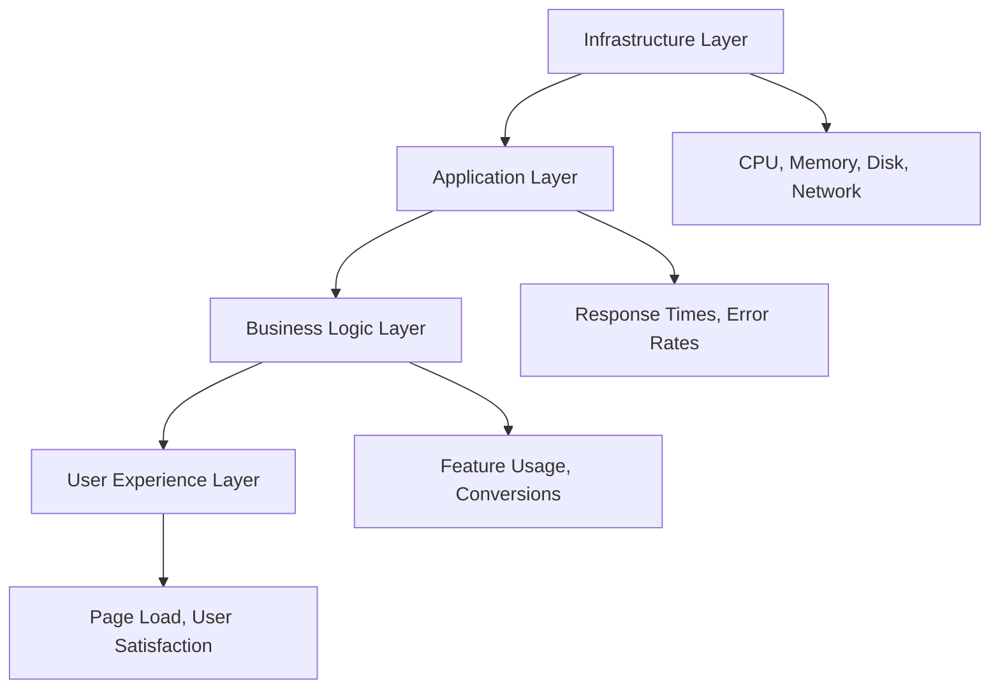

# Chapter 33: System Monitoring

## Table of Contents

1. [Monitoring Strategy](#monitoring-strategy)
2. [Monitoring Tools](#monitoring-tools)
3. [Application Performance Monitoring](#application-performance-monitoring)
4. [Database Monitoring](#database-monitoring)
5. [API Monitoring](#api-monitoring)
6. [Real-time Monitoring](#real-time-monitoring)
7. [Log Aggregation](#log-aggregation)
8. [Alerting & Notifications](#alerting--notifications)
9. [Key Metrics & KPIs](#key-metrics--kpis)
10. [Dashboard Setup](#dashboard-setup)

## Monitoring Strategy

### Overview

Effective monitoring is crucial for maintaining platform reliability, performance, and user satisfaction. The Southville 8B NHS Edge platform implements a comprehensive monitoring strategy covering all layers of the application stack.

### Monitoring Pillars

#### 1. The Four Golden Signals

```yaml
Latency:
  Description: Time taken to serve requests
  Target: P95 < 500ms, P99 < 1000ms

Throughput:
  Description: Requests per second
  Target: Track and trend, no hard limit

Errors:
  Description: Rate of failed requests
  Target: < 0.1% error rate

Saturation:
  Description: Resource utilization
  Target: < 70% CPU, < 80% Memory
```

#### 2. Observability Triangle

```typescript
// Metrics - Quantitative measurements
interface Metrics {
  timestamp: Date;
  metricName: string;
  value: number;
  tags: Record<string, string>;
}

// Logs - Event records
interface LogEntry {
  timestamp: Date;
  level: 'debug' | 'info' | 'warn' | 'error';
  message: string;
  context: Record<string, unknown>;
  traceId?: string;
}

// Traces - Request flow tracking
interface Trace {
  traceId: string;
  spanId: string;
  parentSpanId?: string;
  operation: string;
  duration: number;
  tags: Record<string, string>;
}
```

### Monitoring Layers



### Monitoring Philosophy

**Proactive vs Reactive**:
- Monitor leading indicators, not just lagging ones
- Alert on trends before they become problems
- Predict issues using anomaly detection

**SLI/SLO/SLA Framework**:

```yaml
Service Level Indicators (SLI):
  - API response time
  - Error rate
  - Availability
  - Data freshness

Service Level Objectives (SLO):
  - 99.9% availability
  - P95 response time < 500ms
  - Error rate < 0.1%

Service Level Agreements (SLA):
  - 99.5% uptime guarantee
  - < 4.5 hours downtime per year
  - Response to critical issues < 1 hour
```

## Monitoring Tools

### Tool Stack Overview

```yaml
Application Performance Monitoring:
  Primary: New Relic / Datadog
  Alternative: Sentry (error tracking)

Infrastructure Monitoring:
  Primary: Grafana + Prometheus
  Cloud Native: Cloudflare Analytics, Vercel Analytics

Log Management:
  Primary: ELK Stack (Elasticsearch, Logstash, Kibana)
  Alternative: Datadog Logs, Loki

Uptime Monitoring:
  Primary: UptimeRobot / Pingdom
  Synthetic: Checkly

Real User Monitoring:
  Primary: Google Analytics 4
  Performance: Vercel Analytics, Web Vitals
```

### Tool Installation

#### Prometheus + Grafana

```yaml
# docker-compose.monitoring.yml
version: '3.8'

services:
  prometheus:
    image: prom/prometheus:latest
    container_name: prometheus
    volumes:
      - ./prometheus/prometheus.yml:/etc/prometheus/prometheus.yml
      - prometheus_data:/prometheus
    command:
      - '--config.file=/etc/prometheus/prometheus.yml'
      - '--storage.tsdb.path=/prometheus'
      - '--web.console.libraries=/etc/prometheus/console_libraries'
      - '--web.console.templates=/etc/prometheus/consoles'
      - '--storage.tsdb.retention.time=30d'
      - '--web.enable-lifecycle'
    ports:
      - "9090:9090"
    restart: unless-stopped
    networks:
      - monitoring

  grafana:
    image: grafana/grafana:latest
    container_name: grafana
    volumes:
      - grafana_data:/var/lib/grafana
      - ./grafana/provisioning:/etc/grafana/provisioning
    environment:
      - GF_SECURITY_ADMIN_USER=admin
      - GF_SECURITY_ADMIN_PASSWORD=${GRAFANA_PASSWORD}
      - GF_USERS_ALLOW_SIGN_UP=false
    ports:
      - "3030:3000"
    restart: unless-stopped
    networks:
      - monitoring
    depends_on:
      - prometheus

  node-exporter:
    image: prom/node-exporter:latest
    container_name: node-exporter
    command:
      - '--path.rootfs=/host'
    pid: host
    restart: unless-stopped
    volumes:
      - '/:/host:ro,rslave'
    networks:
      - monitoring

  cadvisor:
    image: gcr.io/cadvisor/cadvisor:latest
    container_name: cadvisor
    volumes:
      - /:/rootfs:ro
      - /var/run:/var/run:ro
      - /sys:/sys:ro
      - /var/lib/docker/:/var/lib/docker:ro
      - /dev/disk/:/dev/disk:ro
    ports:
      - "8080:8080"
    restart: unless-stopped
    networks:
      - monitoring

volumes:
  prometheus_data:
  grafana_data:

networks:
  monitoring:
    driver: bridge
```

#### Prometheus Configuration

```yaml
# prometheus/prometheus.yml
global:
  scrape_interval: 15s
  evaluation_interval: 15s
  external_labels:
    monitor: 'southville-8b-nhs'
    environment: 'production'

alerting:
  alertmanagers:
    - static_configs:
        - targets:
            - alertmanager:9093

rule_files:
  - 'alerts/*.yml'

scrape_configs:
  # Node Exporter - System metrics
  - job_name: 'node-exporter'
    static_configs:
      - targets: ['node-exporter:9100']

  # cAdvisor - Container metrics
  - job_name: 'cadvisor'
    static_configs:
      - targets: ['cadvisor:8080']

  # NestJS API
  - job_name: 'nestjs-api'
    metrics_path: '/metrics'
    static_configs:
      - targets: ['api:3000']
    relabel_configs:
      - source_labels: [__address__]
        target_label: instance
        replacement: 'api-server'

  # Chat Service
  - job_name: 'chat-service'
    metrics_path: '/metrics'
    static_configs:
      - targets: ['chat-service:3001']

  # PostgreSQL Exporter
  - job_name: 'postgresql'
    static_configs:
      - targets: ['postgres-exporter:9187']
```

## Application Performance Monitoring

### Next.js Frontend Monitoring

#### Web Vitals Tracking

```typescript
// frontend-nextjs/lib/monitoring/web-vitals.ts
import { onCLS, onFID, onFCP, onLCP, onTTFB, Metric } from 'web-vitals';

export function reportWebVitals(metric: Metric) {
  // Send to analytics endpoint
  const body = JSON.stringify({
    name: metric.name,
    value: metric.value,
    rating: metric.rating,
    delta: metric.delta,
    id: metric.id,
    navigationType: metric.navigationType,
  });

  // Use navigator.sendBeacon if available
  if (navigator.sendBeacon) {
    navigator.sendBeacon('/api/analytics/vitals', body);
  } else {
    fetch('/api/analytics/vitals', {
      method: 'POST',
      body,
      headers: { 'Content-Type': 'application/json' },
      keepalive: true,
    });
  }
}

// Initialize monitoring
export function initWebVitals() {
  onCLS(reportWebVitals);
  onFID(reportWebVitals);
  onFCP(reportWebVitals);
  onLCP(reportWebVitals);
  onTTFB(reportWebVitals);
}
```

#### Custom Performance Tracking

```typescript
// frontend-nextjs/lib/monitoring/performance.ts
export class PerformanceMonitor {
  private static instance: PerformanceMonitor;

  private constructor() {
    this.setupPerformanceObserver();
  }

  static getInstance(): PerformanceMonitor {
    if (!PerformanceMonitor.instance) {
      PerformanceMonitor.instance = new PerformanceMonitor();
    }
    return PerformanceMonitor.instance;
  }

  private setupPerformanceObserver() {
    if (typeof window === 'undefined') return;

    // Monitor long tasks (> 50ms)
    const observer = new PerformanceObserver((list) => {
      for (const entry of list.getEntries()) {
        if (entry.duration > 50) {
          this.reportLongTask(entry);
        }
      }
    });

    observer.observe({ entryTypes: ['longtask'] });

    // Monitor resource loading
    const resourceObserver = new PerformanceObserver((list) => {
      for (const entry of list.getEntries()) {
        this.reportResourceTiming(entry as PerformanceResourceTiming);
      }
    });

    resourceObserver.observe({ entryTypes: ['resource'] });
  }

  private reportLongTask(entry: PerformanceEntry) {
    fetch('/api/analytics/long-task', {
      method: 'POST',
      headers: { 'Content-Type': 'application/json' },
      body: JSON.stringify({
        name: entry.name,
        duration: entry.duration,
        startTime: entry.startTime,
        timestamp: new Date().toISOString(),
      }),
      keepalive: true,
    });
  }

  private reportResourceTiming(entry: PerformanceResourceTiming) {
    // Only report slow resources (> 1s)
    if (entry.duration > 1000) {
      fetch('/api/analytics/slow-resource', {
        method: 'POST',
        headers: { 'Content-Type': 'application/json' },
        body: JSON.stringify({
          name: entry.name,
          duration: entry.duration,
          size: entry.transferSize,
          type: entry.initiatorType,
          timestamp: new Date().toISOString(),
        }),
        keepalive: true,
      });
    }
  }

  // Track custom user interactions
  trackInteraction(action: string, metadata?: Record<string, unknown>) {
    const startTime = performance.now();

    return () => {
      const duration = performance.now() - startTime;

      fetch('/api/analytics/interaction', {
        method: 'POST',
        headers: { 'Content-Type': 'application/json' },
        body: JSON.stringify({
          action,
          duration,
          metadata,
          timestamp: new Date().toISOString(),
        }),
        keepalive: true,
      });
    };
  }
}

// Usage example
export function usePerformanceTracking(componentName: string) {
  useEffect(() => {
    const monitor = PerformanceMonitor.getInstance();
    const endTracking = monitor.trackInteraction('component_mount', {
      component: componentName,
    });

    return endTracking;
  }, [componentName]);
}
```

#### Error Boundary Monitoring

```typescript
// frontend-nextjs/components/error-boundary.tsx
'use client';

import React, { Component, ErrorInfo, ReactNode } from 'react';

interface Props {
  children: ReactNode;
  fallback?: ReactNode;
}

interface State {
  hasError: boolean;
  error?: Error;
}

export class ErrorBoundary extends Component<Props, State> {
  constructor(props: Props) {
    super(props);
    this.state = { hasError: false };
  }

  static getDerivedStateFromError(error: Error): State {
    return { hasError: true, error };
  }

  componentDidCatch(error: Error, errorInfo: ErrorInfo) {
    // Log to monitoring service
    this.logErrorToService(error, errorInfo);
  }

  private async logErrorToService(error: Error, errorInfo: ErrorInfo) {
    try {
      await fetch('/api/analytics/error', {
        method: 'POST',
        headers: { 'Content-Type': 'application/json' },
        body: JSON.stringify({
          message: error.message,
          stack: error.stack,
          componentStack: errorInfo.componentStack,
          timestamp: new Date().toISOString(),
          userAgent: navigator.userAgent,
          url: window.location.href,
        }),
      });
    } catch (loggingError) {
      console.error('Failed to log error:', loggingError);
    }
  }

  render() {
    if (this.state.hasError) {
      return this.props.fallback || (
        <div className="error-boundary-fallback">
          <h2>Something went wrong</h2>
          <p>We've been notified and are working on it.</p>
        </div>
      );
    }

    return this.props.children;
  }
}
```

### NestJS Backend Monitoring

#### Prometheus Metrics Integration

```typescript
// backend-nestjs/src/monitoring/prometheus.service.ts
import { Injectable, OnModuleInit } from '@nestjs/common';
import { Counter, Histogram, Gauge, Registry } from 'prom-client';

@Injectable()
export class PrometheusService implements OnModuleInit {
  private readonly registry: Registry;

  // HTTP metrics
  private readonly httpRequestTotal: Counter;
  private readonly httpRequestDuration: Histogram;
  private readonly httpRequestSize: Histogram;
  private readonly httpResponseSize: Histogram;

  // Database metrics
  private readonly dbQueryDuration: Histogram;
  private readonly dbConnectionsActive: Gauge;

  // Business metrics
  private readonly activeUsers: Gauge;
  private readonly assignmentSubmissions: Counter;

  constructor() {
    this.registry = new Registry();

    // HTTP Metrics
    this.httpRequestTotal = new Counter({
      name: 'http_requests_total',
      help: 'Total number of HTTP requests',
      labelNames: ['method', 'route', 'status_code'],
      registers: [this.registry],
    });

    this.httpRequestDuration = new Histogram({
      name: 'http_request_duration_seconds',
      help: 'HTTP request duration in seconds',
      labelNames: ['method', 'route', 'status_code'],
      buckets: [0.1, 0.5, 1, 2, 5, 10],
      registers: [this.registry],
    });

    this.httpRequestSize = new Histogram({
      name: 'http_request_size_bytes',
      help: 'HTTP request size in bytes',
      labelNames: ['method', 'route'],
      buckets: [100, 1000, 10000, 100000, 1000000],
      registers: [this.registry],
    });

    this.httpResponseSize = new Histogram({
      name: 'http_response_size_bytes',
      help: 'HTTP response size in bytes',
      labelNames: ['method', 'route'],
      buckets: [100, 1000, 10000, 100000, 1000000],
      registers: [this.registry],
    });

    // Database Metrics
    this.dbQueryDuration = new Histogram({
      name: 'db_query_duration_seconds',
      help: 'Database query duration in seconds',
      labelNames: ['query_type', 'table'],
      buckets: [0.01, 0.05, 0.1, 0.5, 1, 2, 5],
      registers: [this.registry],
    });

    this.dbConnectionsActive = new Gauge({
      name: 'db_connections_active',
      help: 'Number of active database connections',
      registers: [this.registry],
    });

    // Business Metrics
    this.activeUsers = new Gauge({
      name: 'active_users_total',
      help: 'Number of currently active users',
      labelNames: ['role'],
      registers: [this.registry],
    });

    this.assignmentSubmissions = new Counter({
      name: 'assignment_submissions_total',
      help: 'Total number of assignment submissions',
      labelNames: ['subject', 'grade_level'],
      registers: [this.registry],
    });
  }

  onModuleInit() {
    // Register default metrics (CPU, memory, etc.)
    const collectDefaultMetrics = require('prom-client').collectDefaultMetrics;
    collectDefaultMetrics({ register: this.registry });
  }

  // HTTP Tracking
  recordHttpRequest(
    method: string,
    route: string,
    statusCode: number,
    duration: number,
    requestSize: number,
    responseSize: number,
  ) {
    this.httpRequestTotal.inc({ method, route, status_code: statusCode });
    this.httpRequestDuration.observe({ method, route, status_code: statusCode }, duration);
    this.httpRequestSize.observe({ method, route }, requestSize);
    this.httpResponseSize.observe({ method, route }, responseSize);
  }

  // Database Tracking
  recordDbQuery(queryType: string, table: string, duration: number) {
    this.dbQueryDuration.observe({ query_type: queryType, table }, duration);
  }

  setActiveConnections(count: number) {
    this.dbConnectionsActive.set(count);
  }

  // Business Metrics
  setActiveUsers(role: string, count: number) {
    this.activeUsers.set({ role }, count);
  }

  incrementAssignmentSubmissions(subject: string, gradeLevel: string) {
    this.assignmentSubmissions.inc({ subject, grade_level: gradeLevel });
  }

  // Export metrics
  async getMetrics(): Promise<string> {
    return this.registry.metrics();
  }
}
```

#### Monitoring Middleware

```typescript
// backend-nestjs/src/monitoring/monitoring.middleware.ts
import { Injectable, NestMiddleware } from '@nestjs/common';
import { Request, Response, NextFunction } from 'express';
import { PrometheusService } from './prometheus.service';

@Injectable()
export class MonitoringMiddleware implements NestMiddleware {
  constructor(private readonly prometheus: PrometheusService) {}

  use(req: Request, res: Response, next: NextFunction) {
    const startTime = Date.now();
    const requestSize = parseInt(req.headers['content-length'] || '0', 10);

    // Track response
    res.on('finish', () => {
      const duration = (Date.now() - startTime) / 1000;
      const responseSize = parseInt(res.get('content-length') || '0', 10);
      const route = this.extractRoute(req);

      this.prometheus.recordHttpRequest(
        req.method,
        route,
        res.statusCode,
        duration,
        requestSize,
        responseSize,
      );
    });

    next();
  }

  private extractRoute(req: Request): string {
    // Extract route pattern from request
    if (req.route) {
      return req.route.path;
    }
    // Fallback to path (sanitize IDs)
    return req.path.replace(/\/\d+/g, '/:id');
  }
}
```

#### Health Check Endpoint

```typescript
// backend-nestjs/src/health/health.controller.ts
import { Controller, Get } from '@nestjs/common';
import {
  HealthCheck,
  HealthCheckService,
  HttpHealthIndicator,
  TypeOrmHealthIndicator,
  DiskHealthIndicator,
  MemoryHealthIndicator,
} from '@nestjs/terminus';
import { Public } from '../auth/decorators/public.decorator';

@Controller('health')
export class HealthController {
  constructor(
    private health: HealthCheckService,
    private http: HttpHealthIndicator,
    private db: TypeOrmHealthIndicator,
    private disk: DiskHealthIndicator,
    private memory: MemoryHealthIndicator,
  ) {}

  @Get()
  @Public()
  @HealthCheck()
  check() {
    return this.health.check([
      // Database check
      () => this.db.pingCheck('database'),

      // Memory check (heap should not exceed 300MB)
      () => this.memory.checkHeap('memory_heap', 300 * 1024 * 1024),

      // Storage check (should have at least 50% free)
      () => this.disk.checkStorage('storage', {
        thresholdPercent: 0.5,
        path: '/'
      }),

      // Supabase check
      () => this.http.pingCheck(
        'supabase',
        process.env.SUPABASE_URL + '/rest/v1/',
      ),
    ]);
  }

  @Get('ready')
  @Public()
  @HealthCheck()
  checkReadiness() {
    // More strict checks for readiness
    return this.health.check([
      () => this.db.pingCheck('database', { timeout: 300 }),
    ]);
  }

  @Get('live')
  @Public()
  checkLiveness() {
    // Basic liveness check
    return { status: 'ok', timestamp: new Date().toISOString() };
  }
}
```

## Database Monitoring

### Supabase PostgreSQL Monitoring

#### Query Performance Monitoring

```sql
-- Create extension for pg_stat_statements
CREATE EXTENSION IF NOT EXISTS pg_stat_statements;

-- View slow queries
SELECT
  query,
  calls,
  total_exec_time,
  mean_exec_time,
  max_exec_time,
  stddev_exec_time,
  rows
FROM pg_stat_statements
ORDER BY mean_exec_time DESC
LIMIT 20;

-- View queries by total time
SELECT
  query,
  calls,
  total_exec_time,
  (total_exec_time / calls) as avg_time,
  rows
FROM pg_stat_statements
ORDER BY total_exec_time DESC
LIMIT 20;

-- Find queries with high I/O
SELECT
  query,
  calls,
  shared_blks_hit,
  shared_blks_read,
  shared_blks_written,
  (shared_blks_hit::float / NULLIF(shared_blks_hit + shared_blks_read, 0)) * 100 as cache_hit_ratio
FROM pg_stat_statements
ORDER BY shared_blks_read DESC
LIMIT 20;
```

#### Connection Monitoring

```sql
-- Monitor active connections
SELECT
  datname,
  usename,
  application_name,
  state,
  COUNT(*) as connection_count
FROM pg_stat_activity
GROUP BY datname, usename, application_name, state
ORDER BY connection_count DESC;

-- Find long-running queries
SELECT
  pid,
  now() - query_start as duration,
  state,
  query
FROM pg_stat_activity
WHERE state != 'idle'
  AND now() - query_start > interval '5 minutes'
ORDER BY duration DESC;

-- Check for blocking queries
SELECT
  blocked_locks.pid AS blocked_pid,
  blocked_activity.usename AS blocked_user,
  blocking_locks.pid AS blocking_pid,
  blocking_activity.usename AS blocking_user,
  blocked_activity.query AS blocked_statement,
  blocking_activity.query AS blocking_statement
FROM pg_catalog.pg_locks blocked_locks
JOIN pg_catalog.pg_stat_activity blocked_activity ON blocked_activity.pid = blocked_locks.pid
JOIN pg_catalog.pg_locks blocking_locks
  ON blocking_locks.locktype = blocked_locks.locktype
  AND blocking_locks.database IS NOT DISTINCT FROM blocked_locks.database
  AND blocking_locks.relation IS NOT DISTINCT FROM blocked_locks.relation
  AND blocking_locks.page IS NOT DISTINCT FROM blocked_locks.page
  AND blocking_locks.tuple IS NOT DISTINCT FROM blocked_locks.tuple
  AND blocking_locks.virtualxid IS NOT DISTINCT FROM blocked_locks.virtualxid
  AND blocking_locks.transactionid IS NOT DISTINCT FROM blocked_locks.transactionid
  AND blocking_locks.classid IS NOT DISTINCT FROM blocked_locks.classid
  AND blocking_locks.objid IS NOT DISTINCT FROM blocked_locks.objid
  AND blocking_locks.objsubid IS NOT DISTINCT FROM blocked_locks.objsubid
  AND blocking_locks.pid != blocked_locks.pid
JOIN pg_catalog.pg_stat_activity blocking_activity ON blocking_activity.pid = blocking_locks.pid
WHERE NOT blocked_locks.granted;
```

#### Table Size and Bloat Monitoring

```sql
-- Monitor table sizes
SELECT
  schemaname,
  tablename,
  pg_size_pretty(pg_total_relation_size(schemaname||'.'||tablename)) AS total_size,
  pg_size_pretty(pg_relation_size(schemaname||'.'||tablename)) AS table_size,
  pg_size_pretty(pg_total_relation_size(schemaname||'.'||tablename) - pg_relation_size(schemaname||'.'||tablename)) AS index_size
FROM pg_tables
WHERE schemaname = 'public'
ORDER BY pg_total_relation_size(schemaname||'.'||tablename) DESC
LIMIT 20;

-- Check table bloat
SELECT
  schemaname,
  tablename,
  pg_size_pretty(pg_total_relation_size(schemaname||'.'||tablename)) as size,
  n_dead_tup,
  n_live_tup,
  ROUND(n_dead_tup * 100.0 / NULLIF(n_live_tup + n_dead_tup, 0), 2) as dead_tuple_percent
FROM pg_stat_user_tables
WHERE n_live_tup > 0
ORDER BY n_dead_tup DESC
LIMIT 20;

-- Monitor index usage
SELECT
  schemaname,
  tablename,
  indexname,
  idx_scan as index_scans,
  idx_tup_read as tuples_read,
  idx_tup_fetch as tuples_fetched,
  pg_size_pretty(pg_relation_size(indexrelid)) as index_size
FROM pg_stat_user_indexes
ORDER BY idx_scan ASC, pg_relation_size(indexrelid) DESC
LIMIT 20;
```

#### Cache Hit Ratio Monitoring

```sql
-- Overall cache hit ratio
SELECT
  'cache hit rate' AS metric,
  ROUND(sum(blks_hit) * 100.0 / NULLIF(sum(blks_hit) + sum(blks_read), 0), 2) AS percentage
FROM pg_stat_database;

-- Per-table cache hit ratio
SELECT
  schemaname,
  tablename,
  heap_blks_read,
  heap_blks_hit,
  ROUND(heap_blks_hit * 100.0 / NULLIF(heap_blks_hit + heap_blks_read, 0), 2) as cache_hit_ratio
FROM pg_statio_user_tables
WHERE heap_blks_read + heap_blks_hit > 0
ORDER BY heap_blks_read DESC
LIMIT 20;
```

### Custom Monitoring Views

```sql
-- Create view for database health overview
CREATE OR REPLACE VIEW monitoring.database_health AS
SELECT
  (SELECT COUNT(*) FROM pg_stat_activity WHERE state != 'idle') as active_connections,
  (SELECT COUNT(*) FROM pg_stat_activity) as total_connections,
  (SELECT ROUND(sum(blks_hit) * 100.0 / NULLIF(sum(blks_hit) + sum(blks_read), 0), 2)
   FROM pg_stat_database) as cache_hit_ratio,
  (SELECT COUNT(*)
   FROM pg_stat_activity
   WHERE state != 'idle' AND now() - query_start > interval '5 minutes') as long_running_queries,
  (SELECT pg_size_pretty(pg_database_size(current_database()))) as database_size,
  (SELECT SUM(n_dead_tup) FROM pg_stat_user_tables) as total_dead_tuples,
  now() as measured_at;

-- Query the health view
SELECT * FROM monitoring.database_health;
```

## API Monitoring

### REST API Monitoring

```typescript
// backend-nestjs/src/monitoring/api-metrics.interceptor.ts
import {
  Injectable,
  NestInterceptor,
  ExecutionContext,
  CallHandler,
} from '@nestjs/common';
import { Observable } from 'rxjs';
import { tap } from 'rxjs/operators';
import { PrometheusService } from './prometheus.service';

@Injectable()
export class ApiMetricsInterceptor implements NestInterceptor {
  constructor(private readonly prometheus: PrometheusService) {}

  intercept(context: ExecutionContext, next: CallHandler): Observable<any> {
    const request = context.switchToHttp().getRequest();
    const startTime = Date.now();

    return next.handle().pipe(
      tap({
        next: (data) => {
          const duration = (Date.now() - startTime) / 1000;
          const response = context.switchToHttp().getResponse();

          // Record successful request
          this.recordMetrics(request, response, duration, true);
        },
        error: (error) => {
          const duration = (Date.now() - startTime) / 1000;
          const response = context.switchToHttp().getResponse();

          // Record failed request
          this.recordMetrics(request, response, duration, false);
        },
      }),
    );
  }

  private recordMetrics(req: any, res: any, duration: number, success: boolean) {
    // Additional API-specific metrics
    // This complements the middleware metrics
  }
}
```

### Health Check Automation

```typescript
// backend-nestjs/src/monitoring/health-checker.service.ts
import { Injectable, Logger } from '@nestjs/common';
import { Cron, CronExpression } from '@nestjs/schedule';
import { HttpService } from '@nestjs/axios';
import { lastValueFrom } from 'rxjs';

@Injectable()
export class HealthCheckerService {
  private readonly logger = new Logger(HealthCheckerService.name);

  constructor(private readonly httpService: HttpService) {}

  @Cron(CronExpression.EVERY_MINUTE)
  async checkHealth() {
    try {
      const response = await lastValueFrom(
        this.httpService.get('http://localhost:3000/health'),
      );

      if (response.data.status === 'error') {
        this.logger.error('Health check failed', response.data);
        // Send alert
        await this.sendAlert('Health check failed', response.data);
      }
    } catch (error) {
      this.logger.error('Health check request failed', error);
      await this.sendAlert('Health check request failed', error);
    }
  }

  private async sendAlert(message: string, details: any) {
    // Implementation depends on alerting system
    // Could be email, Slack, PagerDuty, etc.
  }
}
```

## Real-time Monitoring

### Supabase Realtime Monitoring

```typescript
// Monitor Realtime connection health
export class RealtimeMonitor {
  private client: SupabaseClient;
  private connectionStatus: 'connected' | 'disconnected' | 'error' = 'disconnected';
  private reconnectAttempts = 0;
  private maxReconnectAttempts = 5;

  constructor(client: SupabaseClient) {
    this.client = client;
    this.setupMonitoring();
  }

  private setupMonitoring() {
    // Monitor connection state
    const channel = this.client.channel('monitoring');

    channel
      .on('system', { event: '*' }, (payload) => {
        this.handleSystemEvent(payload);
      })
      .subscribe((status) => {
        this.handleSubscriptionStatus(status);
      });

    // Heartbeat check
    setInterval(() => this.checkHeartbeat(), 30000);
  }

  private handleSystemEvent(payload: any) {
    console.log('Realtime system event:', payload);

    // Track events in monitoring system
    fetch('/api/analytics/realtime-event', {
      method: 'POST',
      headers: { 'Content-Type': 'application/json' },
      body: JSON.stringify({
        event: payload.event,
        timestamp: new Date().toISOString(),
      }),
    });
  }

  private handleSubscriptionStatus(status: string) {
    console.log('Realtime subscription status:', status);

    if (status === 'SUBSCRIBED') {
      this.connectionStatus = 'connected';
      this.reconnectAttempts = 0;
    } else if (status === 'CLOSED' || status === 'CHANNEL_ERROR') {
      this.connectionStatus = 'error';
      this.attemptReconnect();
    }

    // Report status
    this.reportConnectionStatus();
  }

  private async checkHeartbeat() {
    // Send ping through channel
    const channel = this.client.channel('heartbeat');
    const startTime = Date.now();

    try {
      await channel.send({
        type: 'broadcast',
        event: 'ping',
        payload: { timestamp: startTime },
      });

      const latency = Date.now() - startTime;

      // Report latency
      await fetch('/api/analytics/realtime-latency', {
        method: 'POST',
        headers: { 'Content-Type': 'application/json' },
        body: JSON.stringify({ latency, timestamp: new Date().toISOString() }),
      });
    } catch (error) {
      console.error('Heartbeat failed:', error);
      this.connectionStatus = 'error';
    }
  }

  private attemptReconnect() {
    if (this.reconnectAttempts >= this.maxReconnectAttempts) {
      console.error('Max reconnection attempts reached');
      this.sendAlert('Realtime connection failed after max attempts');
      return;
    }

    this.reconnectAttempts++;
    const delay = Math.min(1000 * Math.pow(2, this.reconnectAttempts), 30000);

    setTimeout(() => {
      console.log(`Reconnection attempt ${this.reconnectAttempts}`);
      this.setupMonitoring();
    }, delay);
  }

  private reportConnectionStatus() {
    fetch('/api/analytics/realtime-status', {
      method: 'POST',
      headers: { 'Content-Type': 'application/json' },
      body: JSON.stringify({
        status: this.connectionStatus,
        reconnectAttempts: this.reconnectAttempts,
        timestamp: new Date().toISOString(),
      }),
    });
  }

  private sendAlert(message: string) {
    // Send to alerting system
    console.error('ALERT:', message);
  }
}
```

### Chat Service Monitoring

```typescript
// chat-service/src/monitoring/chat-metrics.service.ts
import { Injectable } from '@nestjs/common';
import { Counter, Gauge, Histogram } from 'prom-client';

@Injectable()
export class ChatMetricsService {
  // Message metrics
  private readonly messagesTotal: Counter;
  private readonly messageSize: Histogram;
  private readonly messageDeliveryTime: Histogram;

  // Connection metrics
  private readonly activeConnections: Gauge;
  private readonly totalConnections: Counter;

  // Room metrics
  private readonly activeRooms: Gauge;
  private readonly roomMembers: Gauge;

  constructor() {
    this.messagesTotal = new Counter({
      name: 'chat_messages_total',
      help: 'Total number of chat messages',
      labelNames: ['type', 'status'],
    });

    this.messageSize = new Histogram({
      name: 'chat_message_size_bytes',
      help: 'Size of chat messages in bytes',
      buckets: [100, 500, 1000, 5000, 10000],
    });

    this.messageDeliveryTime = new Histogram({
      name: 'chat_message_delivery_seconds',
      help: 'Time to deliver message to recipients',
      buckets: [0.01, 0.05, 0.1, 0.5, 1, 2],
    });

    this.activeConnections = new Gauge({
      name: 'chat_active_connections',
      help: 'Number of active WebSocket connections',
    });

    this.totalConnections = new Counter({
      name: 'chat_connections_total',
      help: 'Total number of WebSocket connections',
      labelNames: ['status'],
    });

    this.activeRooms = new Gauge({
      name: 'chat_active_rooms',
      help: 'Number of active chat rooms',
    });

    this.roomMembers = new Gauge({
      name: 'chat_room_members',
      help: 'Number of members in chat rooms',
      labelNames: ['room_id'],
    });
  }

  recordMessage(type: string, status: 'sent' | 'failed', size: number, deliveryTime: number) {
    this.messagesTotal.inc({ type, status });
    this.messageSize.observe(size);
    this.messageDeliveryTime.observe(deliveryTime);
  }

  incrementConnections() {
    this.activeConnections.inc();
    this.totalConnections.inc({ status: 'connected' });
  }

  decrementConnections() {
    this.activeConnections.dec();
    this.totalConnections.inc({ status: 'disconnected' });
  }

  setActiveRooms(count: number) {
    this.activeRooms.set(count);
  }

  setRoomMembers(roomId: string, count: number) {
    this.roomMembers.set({ room_id: roomId }, count);
  }
}
```

## Log Aggregation

### Structured Logging

```typescript
// backend-nestjs/src/logging/logger.service.ts
import { Injectable, LoggerService as NestLoggerService } from '@nestjs/common';
import * as winston from 'winston';
import { ElasticsearchTransport } from 'winston-elasticsearch';

@Injectable()
export class LoggerService implements NestLoggerService {
  private logger: winston.Logger;

  constructor() {
    const transports: winston.transport[] = [
      // Console transport for development
      new winston.transports.Console({
        format: winston.format.combine(
          winston.format.colorize(),
          winston.format.timestamp(),
          winston.format.printf(({ timestamp, level, message, ...meta }) => {
            return `${timestamp} [${level}]: ${message} ${
              Object.keys(meta).length ? JSON.stringify(meta, null, 2) : ''
            }`;
          }),
        ),
      }),
    ];

    // Add Elasticsearch transport for production
    if (process.env.NODE_ENV === 'production' && process.env.ELASTICSEARCH_URL) {
      transports.push(
        new ElasticsearchTransport({
          level: 'info',
          clientOpts: {
            node: process.env.ELASTICSEARCH_URL,
            auth: {
              username: process.env.ELASTICSEARCH_USERNAME,
              password: process.env.ELASTICSEARCH_PASSWORD,
            },
          },
          index: 'southville-logs',
        }),
      );
    }

    // Add file transport
    transports.push(
      new winston.transports.File({
        filename: 'logs/error.log',
        level: 'error',
        format: winston.format.combine(
          winston.format.timestamp(),
          winston.format.json(),
        ),
      }),
      new winston.transports.File({
        filename: 'logs/combined.log',
        format: winston.format.combine(
          winston.format.timestamp(),
          winston.format.json(),
        ),
      }),
    );

    this.logger = winston.createLogger({
      level: process.env.LOG_LEVEL || 'info',
      format: winston.format.combine(
        winston.format.timestamp(),
        winston.format.errors({ stack: true }),
        winston.format.json(),
      ),
      defaultMeta: {
        service: 'southville-api',
        environment: process.env.NODE_ENV,
      },
      transports,
    });
  }

  log(message: string, context?: string, meta?: object) {
    this.logger.info(message, { context, ...meta });
  }

  error(message: string, trace?: string, context?: string, meta?: object) {
    this.logger.error(message, { context, trace, ...meta });
  }

  warn(message: string, context?: string, meta?: object) {
    this.logger.warn(message, { context, ...meta });
  }

  debug(message: string, context?: string, meta?: object) {
    this.logger.debug(message, { context, ...meta });
  }

  verbose(message: string, context?: string, meta?: object) {
    this.logger.verbose(message, { context, ...meta });
  }
}
```

### Log Correlation

```typescript
// backend-nestjs/src/logging/correlation.middleware.ts
import { Injectable, NestMiddleware } from '@nestjs/common';
import { Request, Response, NextFunction } from 'express';
import { v4 as uuidv4 } from 'uuid';

@Injectable()
export class CorrelationMiddleware implements NestMiddleware {
  use(req: Request, res: Response, next: NextFunction) {
    // Generate or use existing correlation ID
    const correlationId = req.headers['x-correlation-id'] as string || uuidv4();

    // Attach to request
    req['correlationId'] = correlationId;

    // Add to response headers
    res.setHeader('x-correlation-id', correlationId);

    next();
  }
}

// Usage in logging
export function logWithCorrelation(req: Request, message: string, meta?: object) {
  const correlationId = req['correlationId'];
  logger.log(message, 'API', { correlationId, ...meta });
}
```

## Alerting & Notifications

### Alert Rules

```yaml
# prometheus/alerts/api-alerts.yml
groups:
  - name: api_alerts
    interval: 30s
    rules:
      # High error rate
      - alert: HighErrorRate
        expr: rate(http_requests_total{status_code=~"5.."}[5m]) > 0.05
        for: 5m
        labels:
          severity: critical
        annotations:
          summary: "High error rate detected"
          description: "Error rate is {{ $value }} errors/sec for {{ $labels.route }}"

      # Slow response time
      - alert: SlowResponseTime
        expr: histogram_quantile(0.95, http_request_duration_seconds_bucket) > 2
        for: 10m
        labels:
          severity: warning
        annotations:
          summary: "Slow API response time"
          description: "P95 response time is {{ $value }}s for {{ $labels.route }}"

      # High CPU usage
      - alert: HighCPUUsage
        expr: process_cpu_seconds_total > 0.8
        for: 15m
        labels:
          severity: warning
        annotations:
          summary: "High CPU usage"
          description: "CPU usage is {{ $value }}%"

      # High memory usage
      - alert: HighMemoryUsage
        expr: process_resident_memory_bytes > 1073741824  # 1GB
        for: 15m
        labels:
          severity: warning
        annotations:
          summary: "High memory usage"
          description: "Memory usage is {{ $value | humanize }}B"

      # Database connection pool exhaustion
      - alert: DatabaseConnectionPoolExhausted
        expr: db_connections_active > 90
        for: 5m
        labels:
          severity: critical
        annotations:
          summary: "Database connection pool nearly exhausted"
          description: "Active connections: {{ $value }}"

  - name: database_alerts
    interval: 30s
    rules:
      # Slow queries
      - alert: SlowDatabaseQueries
        expr: histogram_quantile(0.95, db_query_duration_seconds_bucket) > 1
        for: 10m
        labels:
          severity: warning
        annotations:
          summary: "Slow database queries detected"
          description: "P95 query time is {{ $value }}s for {{ $labels.table }}"

      # Low cache hit ratio
      - alert: LowCacheHitRatio
        expr: cache_hit_ratio < 90
        for: 15m
        labels:
          severity: warning
        annotations:
          summary: "Low database cache hit ratio"
          description: "Cache hit ratio is {{ $value }}%"
```

### Notification Channels

```typescript
// backend-nestjs/src/monitoring/notifications.service.ts
import { Injectable } from '@nestjs/common';
import { HttpService } from '@nestjs/axios';
import { lastValueFrom } from 'rxjs';

interface Alert {
  severity: 'critical' | 'warning' | 'info';
  title: string;
  message: string;
  metadata?: Record<string, unknown>;
}

@Injectable()
export class NotificationsService {
  constructor(private readonly httpService: HttpService) {}

  async sendAlert(alert: Alert) {
    // Send to multiple channels based on severity
    const promises: Promise<any>[] = [];

    if (alert.severity === 'critical') {
      promises.push(this.sendPagerDuty(alert));
      promises.push(this.sendSlack(alert, '#alerts-critical'));
      promises.push(this.sendEmail(alert, 'devops@southville8b.edu.ph'));
    } else if (alert.severity === 'warning') {
      promises.push(this.sendSlack(alert, '#alerts-warnings'));
    }

    // Always log
    promises.push(this.logAlert(alert));

    await Promise.all(promises);
  }

  private async sendSlack(alert: Alert, channel: string) {
    const webhookUrl = process.env.SLACK_WEBHOOK_URL;
    if (!webhookUrl) return;

    const color = {
      critical: '#ff0000',
      warning: '#ffa500',
      info: '#0000ff',
    }[alert.severity];

    await lastValueFrom(
      this.httpService.post(webhookUrl, {
        channel,
        attachments: [
          {
            color,
            title: alert.title,
            text: alert.message,
            fields: alert.metadata
              ? Object.entries(alert.metadata).map(([key, value]) => ({
                  title: key,
                  value: String(value),
                  short: true,
                }))
              : [],
            footer: 'Southville 8B NHS Edge',
            ts: Math.floor(Date.now() / 1000),
          },
        ],
      }),
    );
  }

  private async sendPagerDuty(alert: Alert) {
    const apiKey = process.env.PAGERDUTY_API_KEY;
    const serviceKey = process.env.PAGERDUTY_SERVICE_KEY;
    if (!apiKey || !serviceKey) return;

    await lastValueFrom(
      this.httpService.post(
        'https://events.pagerduty.com/v2/enqueue',
        {
          routing_key: serviceKey,
          event_action: 'trigger',
          payload: {
            summary: alert.title,
            severity: alert.severity,
            source: 'southville-monitoring',
            custom_details: alert.metadata,
          },
        },
        {
          headers: {
            'Authorization': `Token token=${apiKey}`,
            'Content-Type': 'application/json',
          },
        },
      ),
    );
  }

  private async sendEmail(alert: Alert, to: string) {
    // Implementation depends on email service
    // Could use SendGrid, AWS SES, etc.
  }

  private async logAlert(alert: Alert) {
    // Log to database or file
    console.log('ALERT:', alert);
  }
}
```

## Key Metrics & KPIs

### Application Metrics

```yaml
Frontend Metrics:
  Core Web Vitals:
    - LCP (Largest Contentful Paint): < 2.5s
    - FID (First Input Delay): < 100ms
    - CLS (Cumulative Layout Shift): < 0.1

  Custom Metrics:
    - Time to Interactive: < 3s
    - First Contentful Paint: < 1.5s
    - Page Load Time: < 3s
    - Bundle Size: Track and trend

Backend Metrics:
  API Performance:
    - Response Time (P50): < 200ms
    - Response Time (P95): < 500ms
    - Response Time (P99): < 1000ms

  Throughput:
    - Requests per second: Track and trend
    - Concurrent requests: Track and trend

  Error Rates:
    - 4xx Error Rate: < 1%
    - 5xx Error Rate: < 0.1%

Database Metrics:
  Performance:
    - Query Time (P95): < 100ms
    - Connection Pool Usage: < 70%
    - Cache Hit Ratio: > 90%

  Health:
    - Dead Tuples: < 10% of total
    - Index Usage: > 95%
    - Table Bloat: < 20%

Real-time Metrics:
  Chat Service:
    - Message Delivery Time: < 100ms
    - Connection Success Rate: > 99%
    - Active Connections: Track and trend

  Supabase Realtime:
    - Subscription Latency: < 50ms
    - Reconnection Rate: < 1%

Business Metrics:
  User Activity:
    - Daily Active Users (DAU): Track and trend
    - Weekly Active Users (WAU): Track and trend
    - Session Duration: Track and trend

  Feature Usage:
    - Assignment Submissions: Track count
    - Quiz Completions: Track count
    - Chat Messages: Track count

  Engagement:
    - Login Frequency: Track and trend
    - Feature Adoption: Track percentages
```

### Monitoring Dashboard

```typescript
// Example dashboard configuration
export const dashboardConfig = {
  panels: [
    {
      title: 'API Response Time',
      type: 'graph',
      queries: [
        'histogram_quantile(0.50, http_request_duration_seconds_bucket)',
        'histogram_quantile(0.95, http_request_duration_seconds_bucket)',
        'histogram_quantile(0.99, http_request_duration_seconds_bucket)',
      ],
    },
    {
      title: 'Error Rate',
      type: 'graph',
      queries: [
        'rate(http_requests_total{status_code=~"4.."}[5m])',
        'rate(http_requests_total{status_code=~"5.."}[5m])',
      ],
    },
    {
      title: 'Database Performance',
      type: 'graph',
      queries: [
        'histogram_quantile(0.95, db_query_duration_seconds_bucket)',
        'db_connections_active',
      ],
    },
    {
      title: 'System Resources',
      type: 'graph',
      queries: [
        'process_cpu_seconds_total',
        'process_resident_memory_bytes',
      ],
    },
  ],
};
```

## Dashboard Setup

### Grafana Dashboard JSON

```json
{
  "dashboard": {
    "title": "Southville 8B NHS Edge - Overview",
    "tags": ["southville", "production"],
    "timezone": "Asia/Manila",
    "panels": [
      {
        "id": 1,
        "title": "Request Rate",
        "type": "graph",
        "targets": [
          {
            "expr": "rate(http_requests_total[5m])",
            "legendFormat": "{{method}} {{route}}"
          }
        ]
      },
      {
        "id": 2,
        "title": "Response Time (P95)",
        "type": "graph",
        "targets": [
          {
            "expr": "histogram_quantile(0.95, rate(http_request_duration_seconds_bucket[5m]))",
            "legendFormat": "{{route}}"
          }
        ]
      },
      {
        "id": 3,
        "title": "Error Rate",
        "type": "graph",
        "targets": [
          {
            "expr": "rate(http_requests_total{status_code=~\"5..\"}[5m])",
            "legendFormat": "5xx errors"
          }
        ]
      }
    ]
  }
}
```

---

**Navigation**:
- [← Volume 7 Overview](./README.md)
- [Next Chapter: Maintenance Procedures →](./34-maintenance-procedures.md)
